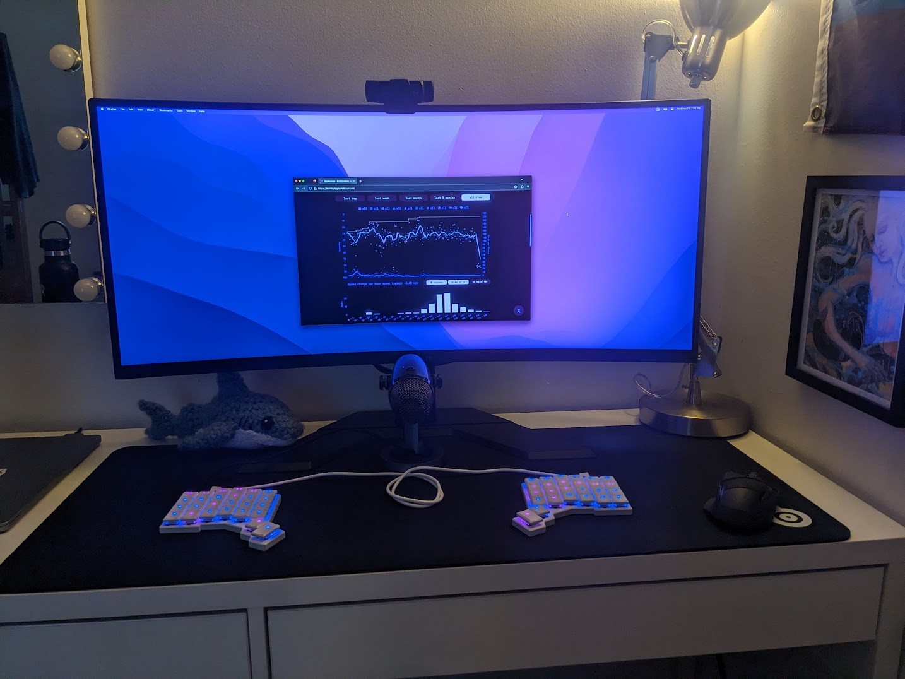
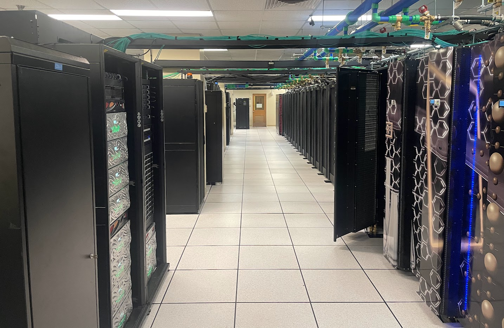
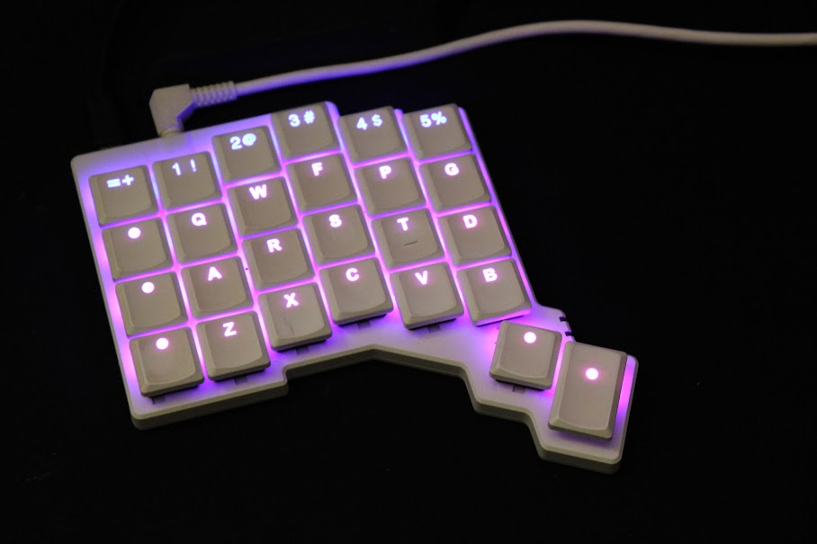

\pagebreak

**Who are you, and what do you do? What do you like to do outside of work?**

Hi y'all, I'm [Kat](https://katnykiel.github.io/)! I'm a PhD candidate at Purdue University. I am fascinated by the concept of stability, and in my research I get to explore this with atomistic simulations and machine learning. Recently, I've been looking at graphene-like materials for ultra-high temperature applications.

Outside of research, I enjoy coding, biking, and playing cello! My partner has gotten me back into reading lately, and it's been a nice change of pace.

**What hardware do you use?**

For my work, I use a base model M2 MacBook Air. Normally, I use this computer with an external monitor and my [ZSA Voyager](https://www.zsa.io/voyager), which I have been extremely happy with the last few months.

The ultra-wide monitor is wonderful for everything from late night coding to watching movies. Most of my work is done with remote development on my university's high performance computing clusters, so it made more sense to save on my laptop specs and instead invest in better interfaces for my computer.

**And what software?**

I use macOS for my research and most of my personal work. I have found small tools like [Maccy](https://github.com/p0deje/Maccy) and [Dozer](https://github.com/Mortennn/Dozer) add to the experience, but I'm most grateful for [Amethyst](https://github.com/ianyh/Amethyst) as a window manager.

Lately, I've been experimenting with [Asahi Linux](https://github.com/AsahiLinux) on my Mac, and it's been great. Everything has been running much more smoothly than I expected, but the lack of support for external displays over HDMI makes it difficult to use as my OS for my work.

As far as specific software, I find myself using pretty much exclusively VSCode and Firefox. VSCode is the home for my coding projects, personal writings, and academic papers, and I've gone pretty far down the rabbit hole of [LaTeX](https://www.latex-project.org/) / [pandoc](https://pandoc.org/index.html) / [beamer](https://ctan.org/pkg/beamer?lang=en).

**What’s your keyboard setup like? Do you use a custom layout or custom keycaps?**

I use [colemak](https://colemak.com/) as my keyboard layout! After using qwerty my whole life, when my ZSA Voyager arrived I switched the colemak layout and never looked back. While it was pretty brutal stumbling around at 20 WPM for the first few weeks, it's now been around 4 months of daily use and I'm back to 80% of my qwerty speed.

As I've used standard qwerty keyboards my whole life, I found that typing on colemak feels so much smoother and easier, even without yet having the same muscle memory as I've built up with qwerty.

**What would be your dream setup?**

I think I'm pretty close to my dream setup now - there's not much more that I could ask for and find that beneficial. The combination of the keyboard, external monitor, and remote development is pretty ideal. That said, I think that the Apple Vision Pro demo of working on your laptop of a VR vacation is pretty appealing.

